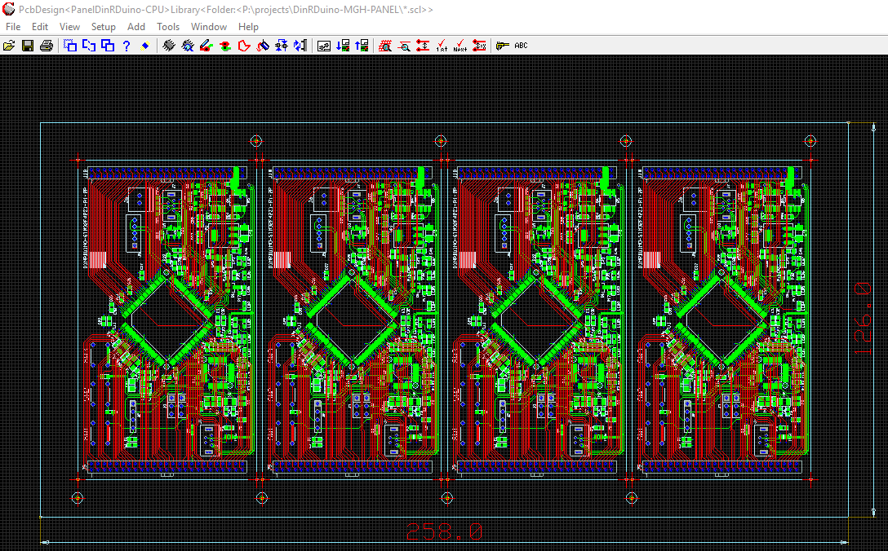
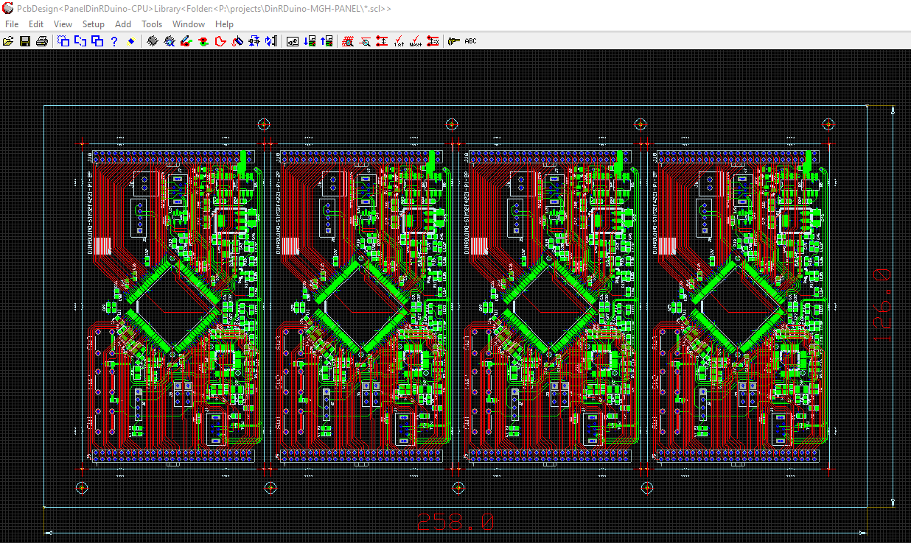
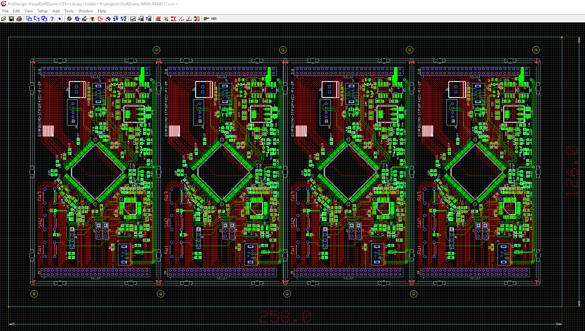
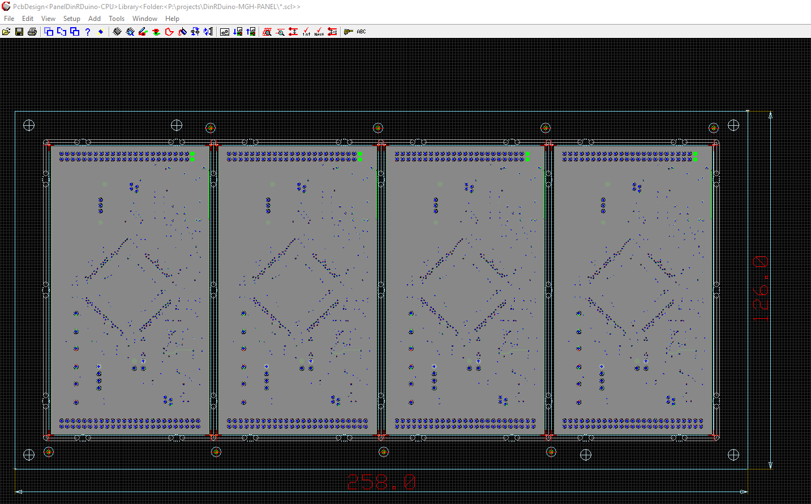

# ManufacturingPanelCreation

* Launch Cadint and "Create New PCB Design" +
  Save as desired Name.
* From Menubar "Add PCB Design as a Component" +
  This is the PCB Design which is to be Panelised and looks like the following. +
  
image::images/PCB-Design.gif[PCB Design to be panellised]
  
* From Menubar select "Tools - Panel Editor" to launch the "Panel Editor" +
  Select the "Panel Utility" +
  Leave "Outline Force" as is +
  Set "Outline Expand" "LEFT". "TOP", "RIGHT" and "BOTTOM" to 12 mm. +
  Set "Step Boards" "X Steps=4", "Y Steps=1", "X Spacing=2", "Y Spacing=2" and "Image=90" +
  Select "Step and Expand Panel" +
* Close Panel Editor to generate the Panelised PCB.
* The Panel Image of Four PCBs is now displayed in the Panel as Follows.

image::images/PopulatedPanel.gif[Populated Panel]
    
* Remove the "V Groove Route Traces" from the panel and replace with "Routed Slots" and "Breakout Sections"
  Hit "V" to Display the Visible Layers.
  Select "Set on exclude" and then "Panel Routing Unplated" followed by "OK" button.
  Select and Delete the "Panel Routing Unplated" lines
  Restore all layers using "V" and "Set on ALL" followed by "OK"

* Move the "Panel Outline" to the desired postion of the "Primary Fiducial"
  In our example this is 6 mm directly below the "Lower Left" corner of the first board
  This is achieved as follows
    A. Gain access to the "Panel local library" by doing a query on "Board 1 Component"
    B. In "Local Library" Select and open "BOARD.DEFAULT" by querying the "Board 1 Component" "LowerLEFT" corner.
    C. Move "MinBoard" and "Panel Outline" lines by X=-12 and Y=-6'
    D. Move "MaxBoard" to be on "Upper Right" corner of "Panel Outline".
    E. Close and "save" "BOARD>DEFAULT".
    F. Open/Load "BOARD>DEFAULT"
    G. Ignore "Match Alternative" warning and press "OK"
    H. Now move all Panel Components by X=-12 and Y=-6 mm
    
* The Panel should now look like the following

image::images/PanelWithCorrectOrigin.gif[Panel at New Origin]

* Add the "Primary Fiducial" to the Panel. +
  From "Cadint Menubar" press "Add" and "PCB Component by Symbol". +
  Navigate to the PCB Symbol Library and Fiducials and select "Fiducial1" +
  Place it at the "Origin" of the Panel. +
  Query Fiducial and "Add New Property" as "PP_FIDUCIAL=PRIMARY" +
  Add "Secondary Fiducial" from Library and place it for "Board 2" +
  Query Fiducial and "Add New Property" as "PP_FIDUCIAL=SECONDARY" +
  Place a Copy of the "Secondary Fiducial" at the rmaining corners of all Four Boards +

* The Panel should now look like the following

* Add "Breakout Section" "Symbols" to the Panel. +
  From the Menubar "Add" "PCB Component by Symbol" and navigate to Symbol Library. +
  Select "BREAKOUT.2x2mm" and place at the following co-ordinates: +
  X=12 Y=5,   X=  45 Y=5,   X=71 Y=5,   X=104 Y=5,   X=130 Y=5,   X=163 Y=5,   X=189 Y=5,   X=222 Y=5, +
  X=12 Y=109, X=  45 Y=109, X=71 Y=109, X=104 Y=109, X=130 Y=109, X=163 Y=109, X=189 Y=109, X=222 Y=109, +
  x=-1 Y=18,  X=  58 Y=18,  X=117 Y=18, X=176 Y=18,  X=235 Y=18 +
  x=-1 Y=57,  X=  58 Y=57,  X=117 Y=57, X=176 Y=57,  X=235 Y=57 +
  x=-1 Y=96,  X=  58 Y=96,  X=117 Y=96, X=176 Y=96,  X=235 Y=96 +
  
* Panel with the "Breakout.2x2mm" Symbols added.  

* Add "Routed Slots" between all the "Breakout.2x2mm" Symbols: +
  From the Cadint Menubar Select Add/Primitives/Wideline +
  Select "Line Attributes" of "Layer="Panel Routing Unplated" and "Width=2mm" +
  Place between all "BREAKOUT.2x2mm" symbols with start and finish offset by 2mm from centres.
  
* The Panel should now look like the following

* Add Panel Tooling Holes as follows +
  From the Cadint Menubar Select Add/Primitives/Drill Hole with Attributes "Layer=Hole Type 2", "Diam=4mm" +
  Place four holes 5mmx5mm inside corners and two holes at Middle top of Board1 and Middle Bottomn of Board 4 +
 
 * The Panel should now look like the following

# The END

  

