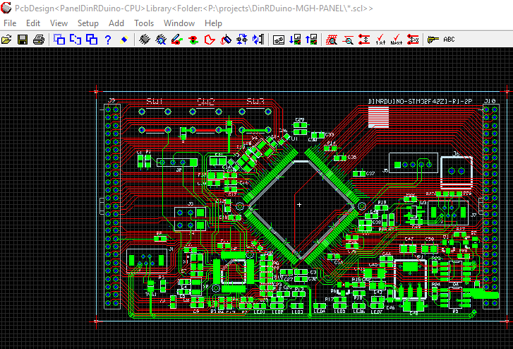
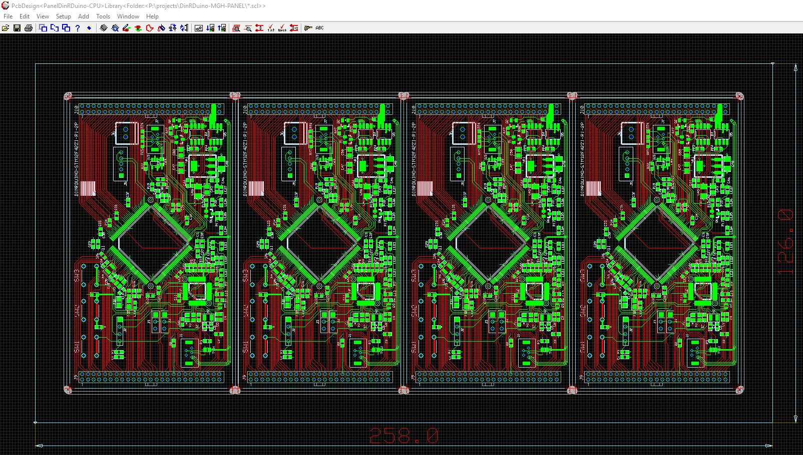
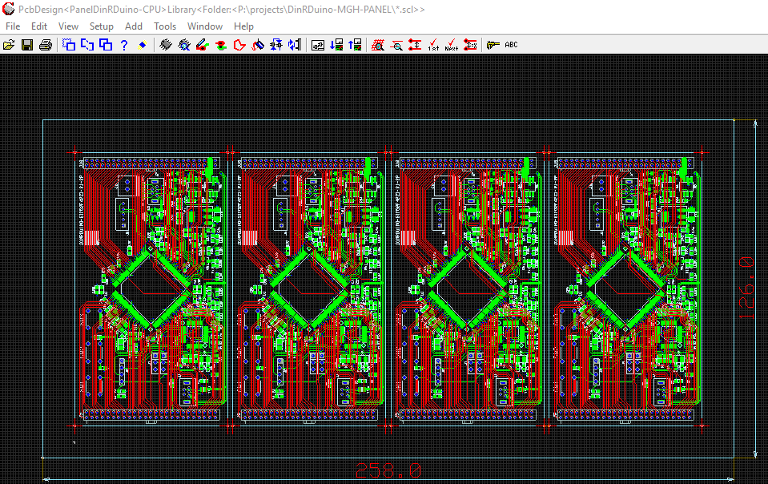

# ManufacturingPanelCreation

* Launch Cadint and "Create New PCB Design" +
  Save as desired Name.
* From Menubar "Add PCB Design as a Component" +
  This is the PCB Design which is to be Panelised and looks like the following. +
  

  
* From Menubar select "Tools - Panel Editor" to launch the "Panel Editor" +
  Select the "Panel Utility" +
  Leave "Outline Force" as is +
  Set "Outline Expand" "LEFT". "TOP", "RIGHT" and "BOTTOM" to 12 mm. +
  Set "Step Boards" "X Steps=4", "Y Steps=1", "X Spacing=2", "Y Spacing=2" and "Image=90" +
  Select "Step and Expand Panel" +
* Close Panel Editor to generate the Panelised PCB.
* The Panel Image of Four PCBs is now displayed in the Panel as Follows.

    
* Remove the "V Groove Route Traces" from the panel and replace with "Routed Slots" and "Breakout Sections"
  Hit "V" to Display the Visible Layers.
  Select "Set on exclude" and then "Panel Routing Unplated" followed by "OK" button.
  Select and Delete the "Panel Routing Unplated" lines
  Restore all layers using "V" and "Set on ALL" followed by "OK"

* Move the "Panel Outline" to the desired postion of the "Primary Fiducial"
  In our example this is 6 mm directly below the "Lower Left" corner of the first board
  This is achieved as follows
    A. Select and open "BOARD.DEFAULT" by querying the "MINBOARD" "LowerLEFT" corner.
    B. Move "MinBoard" and "Panel Outline" lines by X=-12 and Y=-6'
    C. Move "MaxBoard" to be on "Upper Right" corner of "Panel Outline".
    D. Close and "save" "BOARD>DEFAULT".
    E. Open/Load "BOARD>DEFAULT"
    F. Ignore "Match Alternative" warning and press "OK"
    G. Now move all Panel Components by X=-12 and Y=-6 mm
    
* The Panel should now look like the following

